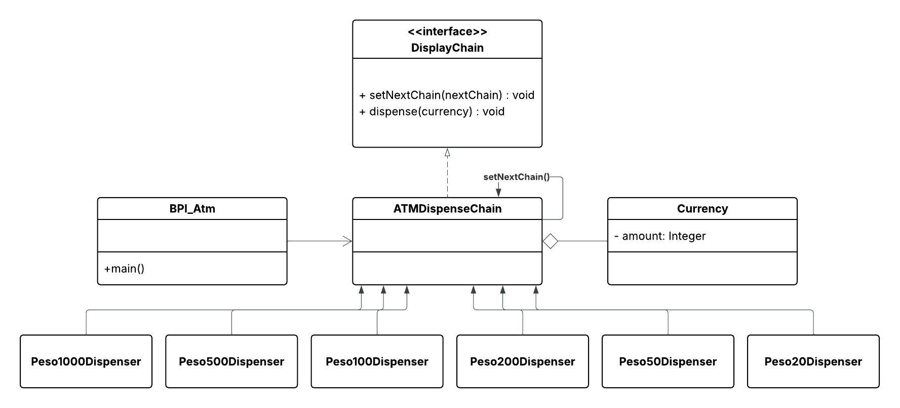

# BPI ATM – Chain of Responsibility Pattern

## Problem

We will design an ATM system for BPI (Bank of the Philippine Islands) that dispenses cash in denominations of **1000 pesos**, **500 pesos**, **200 pesos**, **100 pesos**, **50 pesos**, and **20 pesos** bills. The system follows the **Chain of Responsibility** design pattern to handle the dispensing of cash requests efficiently.

---

## Implementation Overview

The `ATMDispenseChain` class handles the dispensing logic for BPI's ATM system. The `BPI_Atm` class allows users to adjust (hard-coded) an amount and initiates the dispensing process using the Chain of Responsibility pattern.

This design ensures that the ATM system dispenses cash in the specified denominations according to the requested amount.

---

## Elements of the Chain of Responsibility Pattern

In the provided implementation, the elements of the Chain of Responsibility pattern can be identified as follows:

1. **Handler**: The handler objects are the concrete classes that implement the `DispenseChain` interface. In this case, there are six handlers: `Peso1000Dispenser`, `Peso500Dispenser`, `Peso200Dispenser`, `Peso100Dispenser`, `Peso50Dispenser`, and `Peso20Dispenser`. Each handler is responsible for dispensing a specific denomination of currency.

2. **Chain**: The chain is represented by the `ATMDispenseChain` class. It sets up the sequence of handlers by linking them together using the `setNextChain()` method. The chain is responsible for passing the request along the sequence of handlers until one of them handles it.

3. **Request**: The request is represented by the `dispense()` method call made on the first handler in the chain. In this case, the request is to dispense a specific amount of currency.

4. **Client**: The client is the `ATMDispenseChain` class that creates and initializes the chain of handlers. It sends the request to the first handler in the chain by calling the `dispense()` method.

5. **Context**: The context includes the `ATMDispenseChain` class, which manages the chain of handlers and ensures that the request is passed along the chain until it is handled.

Below is the **UML Class Diagram** for this project:

